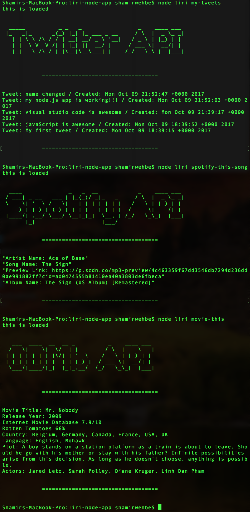

# liri-node-app

This node.js app uses three API's.

- Twitter
- Spotify
- OMDb

Commands
- node liri my-tweets {will show you a list all of the tweets for an alias twitter account that I created}
- node liri spotify-this-song [song] {will search for a song of your choice and return some data that pertains to it}
- node liri movie-this [movie] {will search for a movie of your choice and return some data that pertains to it}
- node liri do-what-it-says {will read from the random.txt file and execute a command from the previous list}

* Example

